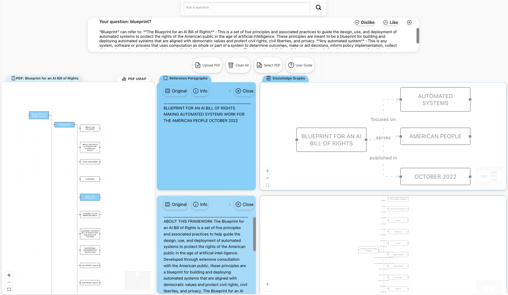

# QuestGraph

## Table of Contents
- [Description](#description)
- [Technologies Used](#technologies-used)
- [Instructions for Use](#instructions-for-use)
- [API Key Configuration](#api-key-configuration)
- [Installation and Configuration](#installation-and-configuration)
- [Front-end](#front-end)
- [Contributing](#contributing)
- [This is our interface.](#this-is-our-interface)

## Description
The project aims to build advanced Knowledge Graphs through the analysis of PDF documents. Utilizing cutting-edge technologies in the field of Natural Language Processing (NLP), the system is capable of processing PDF documents with a clear and well-structured index (referred to as "index", "table of contents", or other obvious variants). By employing OCR and text extraction libraries, the project extracts texts, tables, and images from documents, analyzing the content using techniques such as bounding boxes, chunking, embeddings, Named Entity Recognition (NER), Retrieval-Augmented Generation (RAG), and Uniform Manifold Approximation and Projection (UMAP).

## Technologies Used
The project leverages a wide range of NLP technologies to analyze and interpret documents. Some of the main technologies include:

- **OCR (Optical Character Recognition)**: Used to convert various types of documents, such as scans of printed or handwritten texts, into text data.
  
- **Text Extraction Libraries**: Specialized software for extracting text from documents, such as PDFs or images, facilitating the analysis and processing of text.

- **Bounding Box**: Used in image and video processing, visually represents the area where a specific object is located within the image.

- **Chunking**: A technique used to divide text into smaller pieces (chunks) such as sentences or words, often used in linguistic analysis.

- **Embeddings**: Vector representations of words or phrases that allow machine learning models to interpret text based on context.

- **Named Entity Recognition (NER)**: The process of identifying and classifying named entities (such as names of people, organizations, places) within the text.

- **Retrieval-Augmented Generation (RAG)**: Combines information retrieval techniques with generative models to improve the quality and accuracy of the generated responses.

- **Uniform Manifold Approximation and Projection (UMAP)**: A dimensionality reduction technique often used to visualize data in lower-dimensional spaces while maintaining the structure of high-dimensional data.

## Instructions for Use
Follow the specific instructions for your operating system to install dependencies and start the project.
The project will only be executable if all dependencies are installed for both front-end and back-end and are running.

## API Key Configuration
To fully utilize the system, it's necessary to configure your own API keys for the following services:

- **OpenAI**
- **Firebase**
- **MongoDB**
- **Cohere**

Create a file named ".env" within the back-end file, the syntax should be as follows:

GPT_API_KEY="YOUR_KEY"  
MONGODB_URI="YOUR_KEY"  
COHERE_API_KEY="YOUR_KEY"  
FIREBASE_API_KEY="YOUR_KEY"  
AUTH_DOMAIN="YOUR_KEY"  
DATABASE_URL="YOUR_KEY"  
PROJECT_ID="YOUR_KEY"  
STORAGE_BUCKET="YOUR_KEY"  
MESSAGING_SENDER_ID="YOUR_KEY"  
APP_ID="YOUR_KEY"  
MEASUREMENT_ID="YOUR_KEY"  

## Installation and Configuration
The project supports two different operating systems, each with its own instructions for installing dependencies and running the project.

### Dependencies
#### For MACos
- **pip install torch**
- **pip install spacy-transformers**
- **pip install Flask**
- **pip install flask_cors**
- **pip install pymupdf**
- **pip install pyrebase4**
- **pip install opencv-python**
- **pip install pytesseract**
- **pip install openai**
- **python3 -m spacy download en_core_web_trf**
- **python3 -m spacy download en_core_web_md**
- **pip install cohere**
- **pip install hnswlib**
- **pip install tiktoken**
- **pip install python-dotenv**
- **pip install umap-learn**
- **pip install pymongo**
- **pip install matplotlib**

#### Additional Dependencies for Windows
Install anaconda on your operating system, then install torch followed by the same dependencies listed for the MACos environment. Of course, execute everything in the anaconda environment. 
Download link for anaconda:
[Download anaconda](https://www.anaconda.com/download)
- **conda create --name nome_enviroment**
- **conda activate nome_enviroment**
- **pip install torch**

Once all the dependencies are installed, execute the class:
- **"run.py"** to run the back-end

## Front-end
The front-end of the project is built with React. The React-Flow library is used to visualize and manage the flow of data within the application.

### Dependencies
- **npm install**
- **npm install axios**
- **npm install @tanstack/react-query**
- **npm install framer-motion**
- **npm install react-flow-renderer**
- **npm install lordicon-react**
- **npm install react-hot-toast**
- **npm install firebase**
- **npm install dagre**
- **npm install react-dom**

Once you have installed all the dependencies, you can launch the command:
- **"npm start"** to launch the front-end

## Contributing
Interested in contributing to the project? Great! You can start by reviewing open issues or submitting a pull request with your changes or improvements.

## This is our interface.

